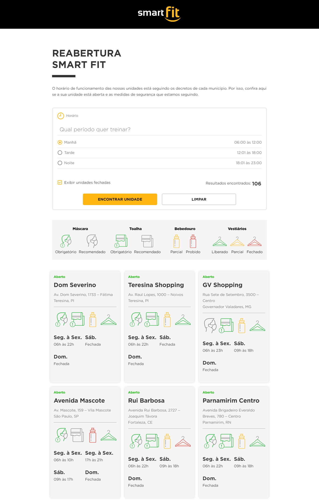

# Front-end Smart Fit
> Esse é um pequeno projeto criado como base para a avaliação de habilidades técnicas para o papel de Front-end.

Veja o projeto em produção <a href="https://vercel.com/erickmedrado/teste-smart-fit">aqui</a>

## Imagem de preview


## Procedimentos para executar o projeto localmente:
Faça um clone do projeto;
Pelo terminal, acesse a pasta do projeto e instale as dependências:
```
npm install
```
Compile o projeto em modo de desenvolvimento:
```
npm run serve
```
Acesse no seu navegador:
```
http://localhost:8080/
```
Ou compile o projeto para produção
```
npm run build
```
